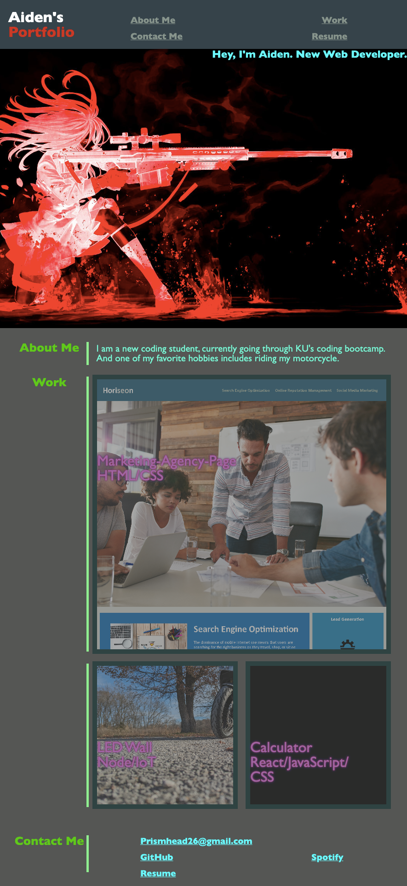

# Portfolio-Page

## Description

The main goal of this project is to create a webpage from scratch, following accessibility standards. This application will be a Portfolio Webpage, highlighting my hard work and progress to becoming a successful developer.
 
After completion of the project, I have a better understanding of Flexbox layouts, media queries, and reset stylesheets. These three components help create a better accessible web application.

## Table of Contents

- [Installation](#installation)
- [Usage](#usage)
- [Credits](#credits)
- [License](#license)
- [Badges](#badges)
- [Features](#features)
- [Tests](#tests)
- [Links](#links)

## Installation

Chrome and/or Firefox are the preferred browsers to view to the program.
 
For the IDE, I recommend the use if Vs Code as well as the "Open with Live Server" Extension.

Steps Include:

- Install tools
- Clone repository
- Pull to local sytem
- Create environment using extension

## Usage

Here's what the expected output should be:

## Links

Link to deployed application:
 
[logo]: https://prismhead26.github.io/Portfolio-Page/ "Portfolio Webpage"
 
Link to HTML file:
 
[HTML](/index.html)
 
Link to CSS-Style file:
 
[CSS-Style](/assets/CSS/style.css)
 
Link to CSS-Reset file:
 
[CSS-Reset](/assets/CSS/reset.css)
 
Link to README file:
 
[README](/README.md)

## Credits

N/A

## License

Please refer to the LICENSE in the repo.

## Badges

 

## Features

CSS, CSS Selectors, media queries, root variables, and Flexbox modelling throughout the code, etc.
 
Basic HTML with semantic elements, more accessible viewport, and lists.
 
A Reset stylesheet file has also been implemented so it can reduce browser inconsistencies.

## Tests

In order to test, run the program using the "Open with Live Server" Exstension.
 
Note: If the images are not visible, you will need to re-link each image in relation to the assets folder.
